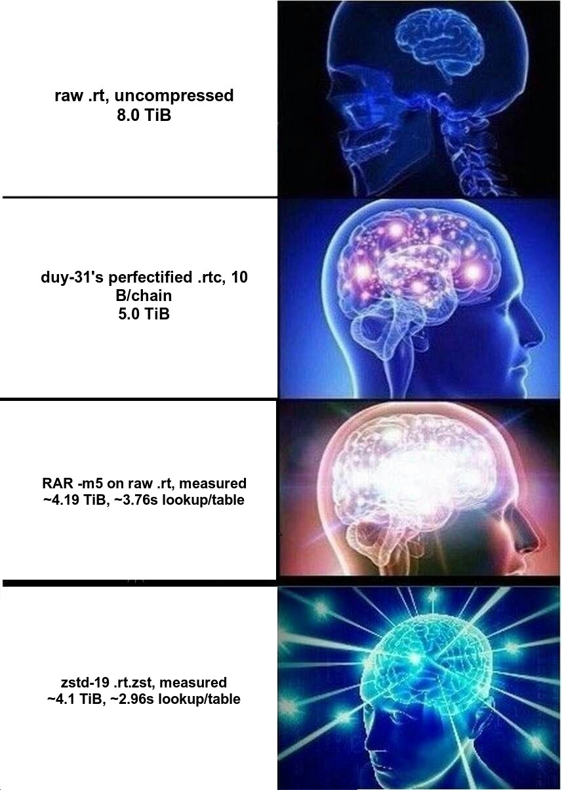

# NetNTLMv1 Rainbow Tables (zstd-compressed)

Rainbow tables for cracking NetNTLMv1 challenge/response hashes, generated with
[Rainbow Crackalack](https://github.com/bandrel/rainbowcrackalack) and compressed
with zstd (`.rt.zst`, level 19).

## Coverage

- **Hash type:** NetNTLMv1 (one DES block per table entry — cracks a 7-byte half
  of the underlying NTLM hash from a captured NetNTLMv1 response)
- **Charset:** `byte` (full 0x00-0xFF keyspace)
- **Chain length:** 881,689
- **Table index:** 0 (single rainbow table, split into parts for parallel generation)
- **Estimated coverage:** ~94.7% of the keyspace (Oechslin single-table model)
- **Parts:** 16,388
- **Total size:** ~4.1 TiB compressed (`.rt.zst`), down from 5.0 TiB as `.rtc`
  (~1.22x smaller, zstd level 19)

`crackalack_lookup` reads `.rt.zst` directly (no manual decompression needed) and
streams the decompression to cap peak RSS, running at hundreds of MB/s — so there's
no meaningful lookup-time penalty versus the raw `.rt` format, just the disk/bandwidth
savings.



## Download

Tables are split into four torrents by part range:

| Range | Magnet | .torrent |
|---|---|---|
| 0-1000 | [magnet](magnet:?xt=urn:btih:2681cfe549c55a0abdeef35028507cd0a6741bcb&xt=urn:btmh:1220ba9c2c4e82a6ad9d6a0d59a6fee8d207c52196e02ed5de077df9ef30f0259c24&dn=0-1000-zstd&xl=1141991538688&tr=udp%3A%2F%2Ftracker.opentrackr.org%3A1337%2Fannounce&tr=udp%3A%2F%2Fopen.demonii.com%3A1337%2Fannounce&tr=udp%3A%2F%2Ftracker.torrent.eu.org%3A451%2Fannounce&tr=udp%3A%2F%2Ftracker.0x7c0.com%3A6969%2Fannounce&tr=udp%3A%2F%2Fopen.stealth.si%3A80%2Fannounce&tr=udp%3A%2F%2Ftracker.dler.org%3A6969%2Fannounce&tr=udp%3A%2F%2Ftracker-udp.gbitt.info%3A80%2Fannounce&tr=udp%3A%2F%2Ftracker.bittor.pw%3A1337%2Fannounce&tr=udp%3A%2F%2Fexodus.desync.com%3A6969%2Fannounce&tr=udp%3A%2F%2Fzer0day.ch%3A1337%2Fannounce&tr=udp%3A%2F%2Fexplodie.org%3A6969%2Fannounce&tr=udp%3A%2F%2Ftracker.qu.ax%3A6969%2Fannounce&tr=udp%3A%2F%2Ftracker.filemail.com%3A6969%2Fannounce&tr=udp%3A%2F%2Ftracker.fnix.net%3A6969%2Fannounce&tr=http%3A%2F%2Ftracker.opentrackr.org%3A1337%2Fannounce&ws=https%3A%2F%2Ftables.bandrel.com%2F) | [0-1000-zstd.torrent](torrents/0-1000-zstd.torrent) |
| 1001-2000 | [magnet](magnet:?xt=urn:btih:2e5867d2d3f1a91848061664c7d75144378146a3&xt=urn:btmh:12206f1836d4b6726940500a1f9669bf93302c6c090aa5272b768b9fbdb8a75ed9bc&dn=1001-2000-zstd&xl=1140850688000&tr=udp%3A%2F%2Ftracker.opentrackr.org%3A1337%2Fannounce&tr=udp%3A%2F%2Fopen.demonii.com%3A1337%2Fannounce&tr=udp%3A%2F%2Ftracker.torrent.eu.org%3A451%2Fannounce&tr=udp%3A%2F%2Ftracker.0x7c0.com%3A6969%2Fannounce&tr=udp%3A%2F%2Fopen.stealth.si%3A80%2Fannounce&tr=udp%3A%2F%2Ftracker.dler.org%3A6969%2Fannounce&tr=udp%3A%2F%2Ftracker-udp.gbitt.info%3A80%2Fannounce&tr=udp%3A%2F%2Ftracker.bittor.pw%3A1337%2Fannounce&tr=udp%3A%2F%2Fexodus.desync.com%3A6969%2Fannounce&tr=udp%3A%2F%2Fzer0day.ch%3A1337%2Fannounce&tr=udp%3A%2F%2Fexplodie.org%3A6969%2Fannounce&tr=udp%3A%2F%2Ftracker.qu.ax%3A6969%2Fannounce&tr=udp%3A%2F%2Ftracker.filemail.com%3A6969%2Fannounce&tr=udp%3A%2F%2Ftracker.fnix.net%3A6969%2Fannounce&tr=http%3A%2F%2Ftracker.opentrackr.org%3A1337%2Fannounce&ws=https%3A%2F%2Ftables.bandrel.com%2F) | [1001-2000-zstd.torrent](torrents/1001-2000-zstd.torrent) |
| 2001-3000 | [magnet](magnet:?xt=urn:btih:fb612cb599a673836f6357ee060f51f1e2dce50e&xt=urn:btmh:1220113e4d58553342b8083bab9cb64d1c2de4e34391198a505c1d5aa7d543cc8b2c&dn=2001-3000-zstd&xl=1141991538688&tr=udp%3A%2F%2Ftracker.opentrackr.org%3A1337%2Fannounce&tr=udp%3A%2F%2Fopen.demonii.com%3A1337%2Fannounce&tr=udp%3A%2F%2Ftracker.torrent.eu.org%3A451%2Fannounce&tr=udp%3A%2F%2Ftracker.0x7c0.com%3A6969%2Fannounce&tr=udp%3A%2F%2Fopen.stealth.si%3A80%2Fannounce&tr=udp%3A%2F%2Ftracker.dler.org%3A6969%2Fannounce&tr=udp%3A%2F%2Ftracker-udp.gbitt.info%3A80%2Fannounce&tr=udp%3A%2F%2Ftracker.bittor.pw%3A1337%2Fannounce&tr=udp%3A%2F%2Fexodus.desync.com%3A6969%2Fannounce&tr=udp%3A%2F%2Fzer0day.ch%3A1337%2Fannounce&tr=udp%3A%2F%2Fexplodie.org%3A6969%2Fannounce&tr=udp%3A%2F%2Ftracker.qu.ax%3A6969%2Fannounce&tr=udp%3A%2F%2Ftracker.filemail.com%3A6969%2Fannounce&tr=udp%3A%2F%2Ftracker.fnix.net%3A6969%2Fannounce&tr=http%3A%2F%2Ftracker.opentrackr.org%3A1337%2Fannounce&ws=https%3A%2F%2Ftables.bandrel.com%2F) | [2001-3000-zstd.torrent](torrents/2001-3000-zstd.torrent) |
| 3001-4095 | [magnet](magnet:?xt=urn:btih:6d04339cf601aa5b45c36012f61bdb578993616c&xt=urn:btmh:1220fe921acd844700d1c890a7a29895467c7a83d6d60ad6a8b301d039b94af56cb1&dn=3001-4095-zstd&xl=1249231503360&tr=udp%3A%2F%2Ftracker.opentrackr.org%3A1337%2Fannounce&tr=udp%3A%2F%2Fopen.demonii.com%3A1337%2Fannounce&tr=udp%3A%2F%2Ftracker.torrent.eu.org%3A451%2Fannounce&tr=udp%3A%2F%2Ftracker.0x7c0.com%3A6969%2Fannounce&tr=udp%3A%2F%2Fopen.stealth.si%3A80%2Fannounce&tr=udp%3A%2F%2Ftracker.dler.org%3A6969%2Fannounce&tr=udp%3A%2F%2Ftracker-udp.gbitt.info%3A80%2Fannounce&tr=udp%3A%2F%2Ftracker.bittor.pw%3A1337%2Fannounce&tr=udp%3A%2F%2Fexodus.desync.com%3A6969%2Fannounce&tr=udp%3A%2F%2Fzer0day.ch%3A1337%2Fannounce&tr=udp%3A%2F%2Fexplodie.org%3A6969%2Fannounce&tr=udp%3A%2F%2Ftracker.qu.ax%3A6969%2Fannounce&tr=udp%3A%2F%2Ftracker.filemail.com%3A6969%2Fannounce&tr=udp%3A%2F%2Ftracker.fnix.net%3A6969%2Fannounce&tr=http%3A%2F%2Ftracker.opentrackr.org%3A1337%2Fannounce&ws=https%3A%2F%2Ftables.bandrel.com%2F) | [3001-4095-zstd.torrent](torrents/3001-4095-zstd.torrent) |

Grab all four ranges for full coverage. Each `.rt.zst` file decompresses with
`crackalack_rt2zst -d` (or the standard `zstd` CLI) before use, if you'd rather not
let `crackalack_lookup` handle it directly. There is minimal performance decrease
due to zstd streaming decompression.

## Usage

```bash
./crackalack_lookup /path/to/tables/ /path/to/netntlmv1_hashes.txt
```

See [Rainbow Crackalack](https://github.com/bandrel/rainbowcrackalack) for build
instructions and full usage docs.

## Verification

A `SHA256SUMS` file (coming soon, alongside the magnet links) covers every part
for integrity verification independent of the torrent client.

## Credits

- Source tables: [duy-31/NetNTLMv1-Perfect-Tables](https://github.com/duy-31/NetNTLMv1-Perfect-Tables)
  — this set is perfectified (duplicate endpoints removed) from those tables, then
  converted back to rt and compressed with Rainbow Crackalack.
- [Rainbow Crackalack](https://github.com/bandrel/rainbowcrackalack), the tool used
  to generate, convert, and compress this set:
  - [Joe Testa](https://www.positronsecurity.com/company/) ([@therealjoetesta](https://twitter.com/therealjoetesta))
    — original author and designer of Rainbow Crackalack, including the OpenCL
    implementation this project is descended from.
  - [blurbdust](https://github.com/blurbdust), who continued Rainbow Crackalack
    after the original went dormant — shout out for the RAR ingest work that gave
    the idea for this release.
  - [Justin Bollinger](https://github.com/bandrel) — current maintainer, added the
    CUDA/Metal GPU backends, mask/Markov generation, NetNTLMv1 fast path, and this
    zstd-compressed release.

## Related Projects

- [evilmog/ntlmv1-multi](https://github.com/evilmog/ntlmv1-multi) — parses and
  downgrades captured NetNTLMv1 challenge/response pairs into the format these
  tables (and hashcat) expect. Complementary tooling, not a table set itself.

## History and Prior Art

NetNTLMv1 rainbow tables are not a new idea — this release sits alongside a long
line of prior public efforts in the same space:

- **crack.sh / cloudcracker.com** — the original public NetNTLMv1/MS-CHAPv2 DES
  cracking service, following from Moxie Marlinspike, David Hulton, and Marsh
  Ray's MS-CHAPv2-breaking work presented at DEF CON 20 (2012). NetNTLMv1 shares
  an almost identical DES-based authentication process, so the same tables and
  techniques carried over. See David Hulton's DES tooling:
  [desrtop](https://github.com/h1kari/desrtop),
  [des_kpt](https://github.com/h1kari/des_kpt),
  [desrtfpga](https://github.com/h1kari/desrtfpga).
- **blurbdust's community regeneration** (Oct 2019 - Dec 2024) — a multi-year
  volunteer effort to recreate the crack.sh tables from scratch after they became
  unavailable, using a `rainbowtables@home`-style distributed client and a fork
  of the classic RainbowCrack-NG codebase
  ([inAudible-NG/RainbowCrack-NG](https://github.com/inAudible-NG/RainbowCrack-NG)).
  This is the same [blurbdust](https://github.com/blurbdust) already credited
  above for Rainbow Crackalack's RAR ingest work.
- **Mandiant / Google Cloud Security** — regenerated the full table set at data
  center scale (internally named `rtv2`, corrected and re-released as `rtv3`
  after a parameter bug was caught), and released the resulting dataset publicly
  under a CC-BY license in December 2024 via
  [Google Research](https://research.google/resources/datasets/?search=Net-NTLMv1&dataset_types=other).
  Documented by Nic Losby in the talk *"Net-NTLMv1: The Easy Path for Red
  Teamers"* (Mandiant, November 2025).
